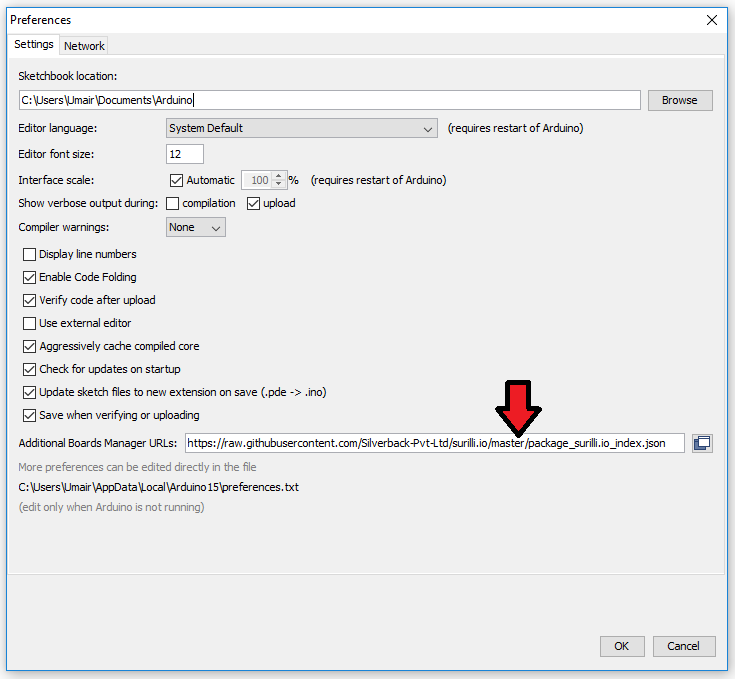
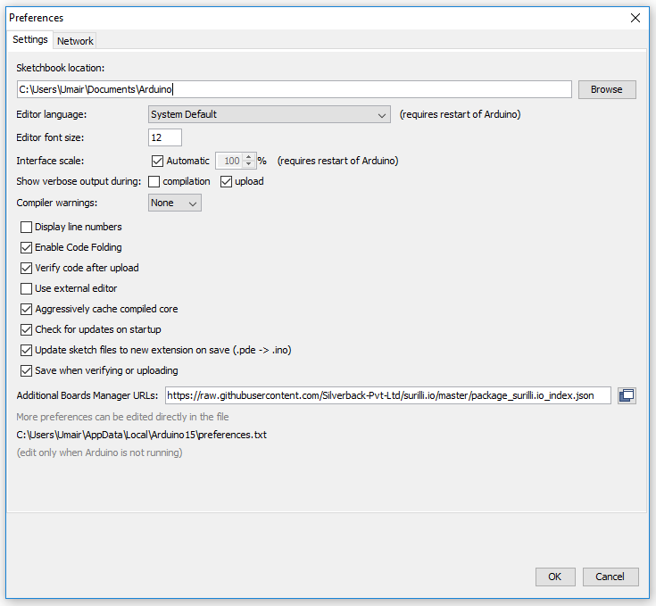
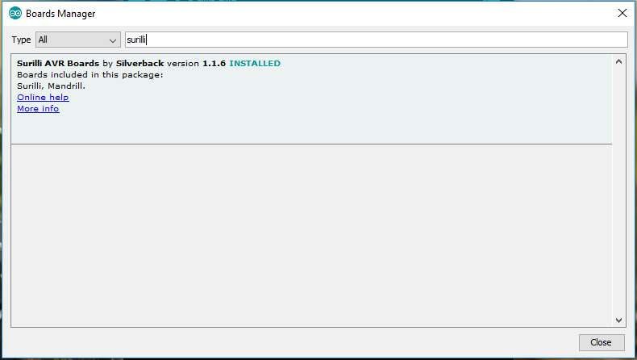

# Surilli AVR Boards

This repository contains support for the following Surilli Arduino-compatible avr boards.

**IMPORTANT NOTE:** These board files have been updated for compatibility with Arduino version 1.8 and higher. If you need compatibility with earlier versions of Arduino, you can choose previous releases of these boards from the Boards Manager.
### AVR Boards
*	Surilli
*	Mandrill

### Installation Instructions

To add board support for our products, start Arduino and open the Preferences window (**File** > **Preferences**). Now copy and paste the following URL into the 'Additional Boards Manager URLs' input field:

       https://raw.githubusercontent.com/Silverback-Pvt-Ltd/surilli.io/master/package_surilli.io_index.json

 
If there is already an URL from another manufacturer in that field, click the button at the right end of the field. This will open an editing window allowing you to paste the above URL onto a new line.

### AVR Installation Instructions
Open the Boards Manager window by selecting Tools > Board, scroll to the top of the board list, and select Boards Manager.

If you type "surilli" into the "filter your search" field, you will see options to install Surilli AVR boards. Click in the desired box, and click the "Install" button that appears. Once installed, the boards will appear at the bottom of the board list.
 

**Have fun!**

